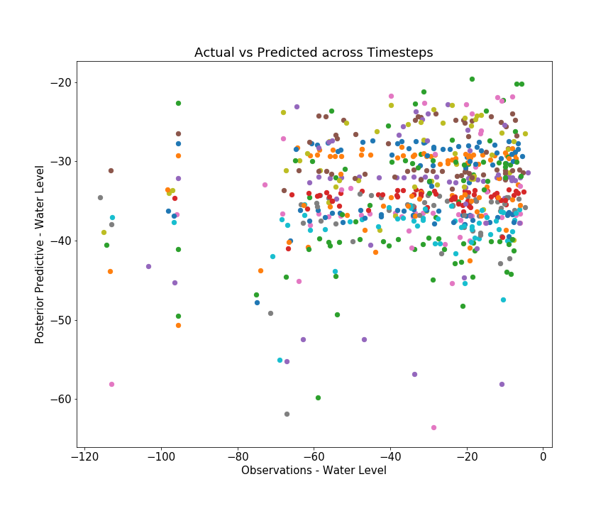

# Predicting Ground Water Levels with Kernel Regression


```python
from __future__ import absolute_import, division, print_function

import os
import json
import pyro
import torch
import pickle
import numpy as np
import pandas as pd
import matplotlib.pyplot as plt
import pyro.distributions as dist

from functools import partial
from pyro.infer.mcmc import NUTS
from pyro.infer.mcmc.api import MCMC
from helper import pairwise_distances, summary
from IPython.display import Video, HTML, Image, display

pyro.set_rng_seed(0)
```


```python
%matplotlib inline

# Enable validation checks
pyro.enable_validation(True)

smoke_test = "CI" in os.environ

assert pyro.__version__.startswith("0.4.1")
```


```python
if torch.cuda.is_available():
    torch.set_default_tensor_type('torch.cuda.FloatTensor')
```


```python
use_gp = False

if smoke_test:
    train = True
    save_samples = False
    
    num_samples = 1
    warmup_steps = 1
else:
    train = False
    save_samples = False
    
    num_samples = 1
    warmup_steps = 1
```

## Background

Our area of interest was a small area (125 km x 69 km) 
in North 
Western India in the arid state Rajasthan.  Rajasthan is 
a state
with very little rainfall and thus depends 
heavily on
groundwater for irrigation for agriculture to exist
.  The
groundwater exists in ancient, extinct aquifers 
that no
longer have
very large meaningful inflows, so most 
extraction will
permanantly remove water that could be used in 
the future.

Therefore we posit that there could be certain 
farmers that 
are doing significantly more extraction than 
others, and we assume 
this pattern of usage can be inferred by the 
amount of water table 
decrease in the surrounding wells.

We use a rough hydrological model to inform 
our predictions, that is 
that the rate of water extract decreases rapidly 
as the distance from 
the well that's extracting.

**Figure 1:** Cone of depression created by 
extracting water from a well
. The influence of that extraction on the 
water level at a given 
distance from the well decreases exponentially
 from the source of 
extraction.


Our model assumes roughly that there would be 
an extracting well 
at each visible pixel.  Here are two different 
wells that 
motivated our analysis.  You can see in 
these false color images (
  used to emphasize vegitation) that some 
  wells have 
  singificantly more surrounding vegitation than 
  others.  The well 
  on the left exhibts significantly more extraction 
  over time than the 
  well on the right with fewer farm pixels. 

**Figure 2a/b :** Two different wells 
with varying amounts 
of surrounding vegitation. Note the regular shape 
of farmland 
edges that are exploited using the 
edge detection feature

 


**Figure 3:** Time Series showing depth to well at two 
different highlighted wells


### Dataset
The dataset is comprised of classifications of 
farmland pixels 
from  satellite imagery and point data of 
observation wells' 
depth to groundwater over time.  The 
satellite images were create 
in Google Earth Enigne `/earth-engine/` 
which is a cloud computing 
platform to allow researchers to access 
very large scale image 
datasets and perform operations quickly 
and efficiently.

We use Landsat 5 and draw seasonal observations 
over the period 1996 to 2010.
 To create our classifier we use 4 important 
bands Near Infrared (
  NIR), Shortwave Infrared (SWIR), 
  Visible Red, and a vegitation 
  index that is a combination of the previous 
  bands (EVI).  We 
  then create features and hand-crafted 
  convolutions on top of 
  these layers using the Canny edge 
  detection algorithm and various 
  kernels on both the edge detection 
  layers and the underlying bands.  

**Figure 4:** Image of EVI band (left) and a layer 
of the same band (
  right) after using the Canny edge detection algorithm.


We then create a dataset of training and 
testing pixels by using 
a combination of the false color images 
and Google Earth's very 
high resolution proprietary dataset ($\approx1 \> m$)
 per pixel to 
determine if the features seen in our false
 color image were 
indeed anthropogenic vegitation.  

**Figure 5:** Real color high-resolution image from Google Earth 
Image, proprietary 2019.


We then use the above-mentioned features 
and the training and 
testing pixels (20% held out) to train a 
Random Forest classifier.
  After some cross validation we report 
  an overall testing accuracy 
  of 91.61 with the following performance table:

|                | Farm Testing | Not Farm Testing | 
|----------------|--------------|------------------|
| **Farm Model**     | 209          | 20           | 
| **Not Farm Model** | 9            | 108          | 

We then use the random forest to classify
 our entire region of 
interest in all time steps. The end result 
of the classification 
of all pixels can be seen in the following 
video where wells are 
plotted as squares whose darkeness indicates 
the depth to the 
water table.  I.e. a deeper watertable is 
indicated by a darker pixel.


```python
Video("includes/real-data-animation.mp4")
```


<video src="includes/real-data-animation.mp4" controls  >
      Your browser does not support the <code>video</code> element.
    </video>


## Modeling the Water Level

### Generative Model
---
**Farm Factor**
\begin{align*}
    \ln(\delta) \sim \mathcal{N}(1.0, 0.5)
\end{align*}

**Distance Factors**
\begin{align*}
    \ln(\theta_w) \sim \mathcal{N}(0.0, 0.5) \\
    \ln(\theta_f) \sim \mathcal{N}(0.0, 0.5)
\end{align*}

**Variance**
\begin{align*}
    \sigma^2 \sim \text{Gam}(1.0, 1.0)
\end{align*}

**Seasonal Factors**
For season $s \in \mathcal{S}$
\begin{align*}
    \gamma_s \sim \mathcal{N}(0.0, 1.0)
\end{align*}

**Base Water Levels**

The base water levels are modeled as a simple AR(1) process.
The details of this are as follows

\begin{align*}
    \mu_0 \sim \mathcal{N}(\gamma_{s_0}, 1.0) \\
\end{align*}
For $t = 1 \dots T$, we specify
\begin{align*}
    \mu_{t} \sim \mathcal{N}(\mu_{t - 1} + \gamma_{s_t}, 1.0)
\end{align*}

**Likelihood**

For $t = 0 \dots T$, we specify
\begin{align*}
    \mathbf{y}_t \sim 
    \mathcal{N}(\mu_t - \delta 
    \cdot K(X_{t,w}, X_{t,f})\ /\ \theta_f, 1.0)
\end{align*}

---


### Defining the Model


```python
def model1(
    XW, YW, YF, WF_distances, n_seasons=4, seasons=None, gp=False
):
    assert not torch._C._get_tracing_state()

    delta = pyro.sample("delta", dist.LogNormal(1.0, 0.5))

    if gp:
        theta_w = pyro.sample(
            "theta_w", dist.LogNormal(0.0, 0.5)
        )
    else:
        sigma = pyro.sample("sigma", dist.Gamma(1.0, 1.0))

    theta_f = pyro.sample("theta_f", dist.LogNormal(0.0, 0.5))

    sf = pyro.sample(
        "sf", dist.Normal(torch.zeros(n_seasons), 1.0)
    )
    if seasons is None:
        seasons = np.tile(
            np.arange(n_seasons), int(len(YW) / n_seasons + 1)
        )
        seasons = seasons[:len(YW)]

    mu = 0
    for t in pyro.markov(range(len(YW))):
        if gp:
            sigma = torch.exp(
                -pairwise_distances(XW[t], XW[t]) / theta_w
            )

        mu = pyro.sample(
            "mu_{}".format(t),
            dist.Normal(mu + sf[seasons[t]], 1.0)
        )

        mean = mu - delta * torch.mm(
            torch.exp(-WF_distances[t] / theta_f), YF[t]
        )

        if gp:
            pyro.sample(
                "obs_{}".format(t),
                dist.MultivariateNormal(mean, sigma),
                obs=YW[t]
            )
        else:
            with pyro.plate("data_{}".format(t), len(YW[t])):
                pyro.sample(
                    "obs_{}".format(t),
                    dist.Normal(mean, sigma),
                    obs=YW[t]
                )
```

## Sanity Check - Working with Sample Data

### Reading the Sample Data


```python
data = pd.read_csv(
    "data/test-data.csv", encoding="ISO-8859-1"
)

data_wells = data[data.type == "well"]
data_farms = data[data.type == "farm"]

XW, YW = [], []
for t in data_wells["timestep"].unique():
    data_ = data_wells[data_wells["timestep"] == t]

    XW.append(data_[["latitude", "longitude"]].values)
    YW.append(data_["observation"].values)

XW = XW[0]

XF = data_farms[["latitude", "longitude"]].values
YF = data_farms["observation"].values
```


```python
Video("includes/sample-data-animation.mp4")
```


<video src="includes/sample-data-animation.mp4" controls  >
      Your browser does not support the <code>video</code> element.
    </video>


```python
XW = torch.tensor(XW)
YW = torch.tensor(YW)[..., None]

XF = torch.tensor(XF)
YF = torch.tensor(YF)[..., None]
```


```python
timesteps = len(YW)

XW = XW.repeat(timesteps, 1, 1)

YF = YF.repeat(timesteps, 1, 1)
XF = XF.repeat(timesteps, 1, 1)
```

### Inference (Sample Data - Model 1)


```python
pyro.set_rng_seed(1)
```


```python
samples_file = "models/model1/test-samples.json"
```


```python
try:
    with open(samples_file, "r") as f:
        samples = {
            k: np.array(v) for k, v in json.load(f).items()
        }
except FileNotFoundError:
    print("Failed to load samples file")
```


```python
if train:
    WF_distances = [
        pairwise_distances(XW[i], XF[i]) for i in range(len(YW))
    ]

    nuts_kernel = NUTS(partial(
        model1,
        n_seasons=4,
        WF_distances=WF_distances,
        gp=use_gp
    ))

    mcmc = MCMC(
        nuts_kernel,
        num_samples=num_samples,
        warmup_steps=warmup_steps
    )
    mcmc_run = mcmc.run(XW, YW, YF)

    samples = {
        k: v.detach().cpu().numpy()
        for k, v in mcmc.get_samples().items()
    }
```


```python
mu_samples = []
for k in list(samples.keys()):
    if "mu_" in k:
        mu_samples.append(samples[k][:, None])
        del samples[k]

samples["mu"] = np.concatenate(mu_samples, axis=1)
```


```python
if save_samples:
    samples_ = {k: v.tolist() for k, v in samples.items()}
    with open(samples_file, "w") as f:
        json.dump(samples_, f)
```

## Working with Real Data 

### Reading the Real Data


```python
with open("data/real-data.pkl", "rb") as f:
    XF_r = [np.array(x) for x in pickle.load(f)]
    YF_r = [np.array(x) for x in pickle.load(f)]

    XW_r = [np.array(x) for x in pickle.load(f)]
    YW_r = [np.array(x) for x in pickle.load(f)]

    XS_r = pickle.load(f)
```


```python
XF_r = [torch.tensor(x) for x in XF_r]
YF_r = [torch.tensor(x) for x in YF_r]

XW_r = [torch.tensor(x) for x in XW_r]
YW_r = [torch.tensor(x) for x in YW_r]

XS_r = torch.tensor(XS_r) - 1

Xs = torch.cat(XW_r + XF_r)

x_mean = Xs.mean(0)
x_std = Xs.std(0)

XW_r = [(x - x_mean) / x_std for x in XW_r]
XF_r = [(x - x_mean) / x_std for x in XF_r]
```

### Inference (Real Data - Model 1)


```python
pyro.set_rng_seed(1)
```


```python
samples_file = "models/model1/real-samples.json"
```


```python
try:
    with open(samples_file, "r") as f:
        samples = {
            k: np.array(v) for k, v in json.load(f).items()
        }
except FileNotFoundError:
    print("Failed to load samples file")
```


```python
if train:
    WF_distances = [
        pairwise_distances(XW_r[i], XF_r[i])
        for i in range(len(YW_r))
    ]

    nuts_kernel = NUTS(
        partial(
            model1,
            n_seasons=3,
            seasons=XS_r,
            WF_distances=WF_distances,
            gp=use_gp
        )
    )

    mcmc = MCMC(
        nuts_kernel,
        num_samples=num_samples,
        warmup_steps=warmup_steps
    )
    mcmc_run = mcmc.run(XW_r, YW_r, YF_r)

    samples = {
        k: v.detach().cpu().numpy()
        for k, v in mcmc.get_samples().items()
    }
```


```python
mu_samples = []
for k in list(samples.keys()):
    if "mu_" in k:
        mu_samples.append(samples[k][:, None])
        del samples[k]

samples["mu"] = np.concatenate(mu_samples, axis=1)
```


```python
if save_samples:
    samples_ = {k: v.tolist() for k, v in samples.items()}
    with open(samples_file, "w") as f:
        json.dump(samples_, f)
```

### Posterior Visualizations (Real Data - Model 1)


```python
display(
    Image("includes/model1/scatter_delta_theta_f.png"),
    Image("includes/model1/hist_delta_theta_f.png")
)
```


$\theta_f$ implicitly determines 
the effective distance.
At 23 latitutude, one degree of 
latitude is 110,758 m and
one degree of longitude is 101,751 m. 
Hence if we have 
a well that is $\sqrt{(.001)^2 + (.001)^2}$ or 
$\sqrt{110^2+101^2}\approx 150 m$ 
away then 
$\theta_f$ of 0.055 and a $\delta$ 
of $8\times10^{-4}$
will give the importance of a single
pixel at that 
distance as $\delta \times 
e^{(-.001/.05)}\times y_f$.  

If we assume we have on the order
of 50 classified 
pixels within that distance and 
the average $y_f$ is 
roughly 130, we can calculate the
total effect of the 
farms on a given well's water 
level by dropping it 
$8\times10^{-4} \times 
e^{(-0.001/.05)}\times 
130\times 50 \approx 5.1 \> m$.


```python
Image("includes/model1/mu.png")
```


```python
Image("includes/model1/sf.png")
```


### Model Criticism


```python
Image("includes/model1/predicted_actual.png")
```





Informal model criticism shows 
that our model is not yet fitting 
well to the testing data.  Obvious 
stratifications by time step (color)
can be seen indicating an 
inflexibility within the model.
Examining our assumptions more
closely we can see that this is 
because we only allow for a single 
level $\mu$ for each time scale, 
and we do not account for 
autocorrelation within wells.

### Generative Model
---
**Farm Factor**
\begin{align*}
    \ln(\delta_c) \sim \mathcal{N}(1.0, 0.5)
    \ln(\delta_f) \sim \mathcal{N}(1.0, 0.5)
\end{align*}

**Distance Factor**
\begin{align*}
    \ln(\theta_f) \sim \mathcal{N}(1.0, 0.5)
\end{align*}

**Variance**
\begin{align*}
    \sigma^2 \sim \text{Gam}(1.0, 1.0)
\end{align*}

**Seasonal Factors**

For all seasons $s \in \mathcal{S}$, we define
\begin{align*}
    \gamma_s \sim \mathcal{N}(0.0, 1.0)
\end{align*}

**Likelihood**

The water level for each well is modeled as an
 AR(1) process which is dependent on the previous
  timestep. The details are as given below

For $t = 1 \dots T$, we specify
\begin{align*}
    \mathbf{y_t} - \mathbf{y_{t - 1}} \sim
    \mathcal{N}\left(
      \gamma_{s_t}
      + \delta_c\; \text{exp} \odot 
      \frac{-K(X_{t,w}, X_{t,f})}{\theta_f}
      + \delta_p\; \text{exp} \odot 
      \frac{-K(X_{t-1,w}, X_{t-1,f})}{\theta_f}
    , 1.0\right) \\
\end{align*}

---


### Defining the Model


```python
def model2(XW, YW, YF, WF_distances, n_seasons=3, seasons=None):
    assert not torch._C._get_tracing_state()

    delta_c = pyro.sample("delta_c", dist.LogNormal(1.0, 0.5))
    delta_p = pyro.sample("delta_p", dist.LogNormal(1.0, 0.5))

    sigma = pyro.sample("sigma", dist.Gamma(1.0, 1.0))
    theta_f = pyro.sample("theta_f", dist.LogNormal(1.0, 0.5))

    sf = pyro.sample(
        "sf", dist.Normal(torch.zeros(n_seasons), 1.0)
    )
    if seasons is None:
        seasons = np.tile(
            np.arange(n_seasons), int(len(YW) / n_seasons + 1)
        )
        seasons = seasons[:len(YW)]

    y = YW[0]
    ff = torch.mm(
        torch.exp(-WF_distances[0] / theta_f), YF[0]
    )

    for t in pyro.markov(range(1, len(YW))):
        with pyro.plate("data_{}".format(t), len(YW[t])):
            mean = y - delta_p * ff + sf[seasons[t]]
            ff = torch.mm(
                torch.exp(-WF_distances[t] / theta_f), YF[t]
            )

            mean -= delta_c * ff

            y = pyro.sample(
                "obs_{}".format(t),
                dist.Normal(mean, sigma),
                obs=YW[t]
            )
```

### Preparing the Real Data


```python
intersection = XW_r[0]

for arr in XW_r[1:]:
    indices = torch.zeros(len(arr), dtype=torch.bool)
    for elem in intersection:
        indices = indices | (
            torch.abs(arr - elem).sum(1) < 1e-8
        )
    intersection = arr[indices]

for i in range(len(XW_r)):
    indices = torch.zeros(len(XW_r[i]), dtype=torch.bool)
    for elem in intersection:
        indices = indices | (
            torch.abs(XW_r[i] - elem).sum(1) < 1e-8
        )

    XW_r[i] = XW_r[i][indices]
    YW_r[i] = YW_r[i][indices]
```

### Inference (Real Data - Model 2)


```python
pyro.set_rng_seed(1)
```


```python
samples_file = "models/model2/real-samples.json"
```


```python
try:
    with open(samples_file, "r") as f:
        samples = {
            k: np.array(v) for k, v in json.load(f).items()
        }
except:
    print("Failed to load samples file")
```


```python
if train:
    WF_distances = [
        pairwise_distances(XW_r[i], XF_r[i])
        for i in range(len(YW_r))
    ]

    nuts_kernel = NUTS(partial(
        model2,
        seasons=XS_r,
        WF_distances=WF_distances
    ))

    mcmc = MCMC(
        nuts_kernel,
        num_samples=num_samples,
        warmup_steps=warmup_steps
    )
    mcmc_run = mcmc.run(XW_r, YW_r, YF_r)

    samples = {
        k: v.detach().cpu().numpy()
        for k, v in mcmc.get_samples().items()
    }

if save_samples:
    samples_ = {
        k: v.tolist() for k, v in samples.items()
    }
    with open(samples_file, "w") as f:
        json.dump(samples_, f)
```

### Posterior Visualizations (Real Data - Model 2)


```python
display(
    Image("includes/model2/scatter_delta_c_delta_p.png"),
    Image("includes/model2/hist_delta_c_delta_p.png")
)
```


```python
display(
    Image("includes/model2/scatter_delta_c_theta_f.png"),
    Image("includes/model2/hist_delta_c_theta_f.png")
)
```


```python
display(
    Image("includes/model2/scatter_delta_p_theta_f.png"),
    Image("includes/model2/hist_delta_p_theta_f.png")
)
```


```python
Image("includes/model2/sf.png")
```


### Model Criticism


```python
Image("includes/model2/predicted_actual.png")
```


This second specification shows
more flexibility and achieves a
higher R^2 (with some scaling issues) 
on in-sample predictions. Likewise we
see expected dependencies between the
parameters of interest. We see a 
complimentary relationship between 
the two deltas and a supplementary 
relationship between either delta
and theta. This makes sense because
in posterior samples where theta is 
large, both deltas will take a smaller
role in driving well water change.
